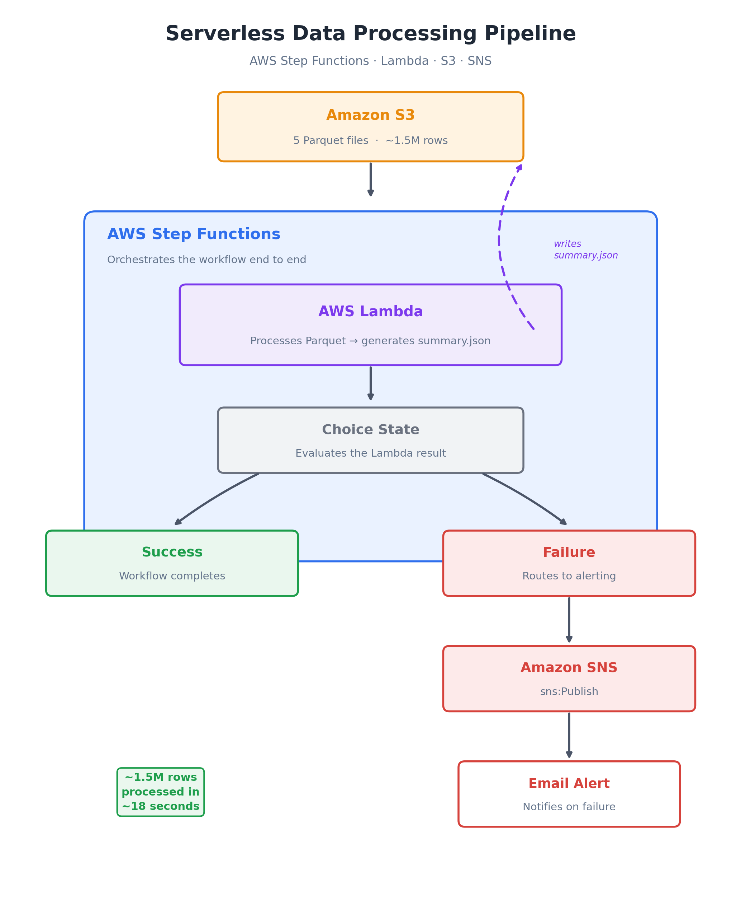

  
  
  
  
  

<h1 align="center">☁️ Serverless Data Processing Pipeline</h1>

  An event-driven, serverless data pipeline built on <b>AWS Step Functions</b>,
  <b>Lambda</b>, <b>S3</b>, and <b>SNS</b>. It processes ~1.5 million rows of Amazon
  review data from five Parquet files, generates a summary JSON output, and routes
  failures to email alerting — with no servers to manage.

  
  
  
  

---

## Table of Contents

- [Overview](#overview)
- [Architecture](#architecture)
- [How the Pipeline Works](#how-the-pipeline-works)
- [Tech Stack](#tech-stack)
- [IAM & Permissions](#iam--permissions)
- [Setup](#setup)
- [Testing](#testing)
- [Performance](#performance)
- [Key Learnings](#key-learnings)
- [Roadmap](#roadmap)
- [License](#license)

---

## Overview

This project is part of a broader Cloud Data Engineering journey, focused on serverless
data processing, workflow orchestration, and automated failure notifications on AWS.
It ingests five Parquet files of Amazon review data (~1.5 million rows total) from S3,
processes them in Lambda, and produces a summary JSON — all coordinated by a Step
Functions state machine that branches on success or failure and alerts by email when
something goes wrong.

## Architecture

  

| Stage | AWS Service | Description |
|---|---|---|
| Storage | Amazon S3 | Holds the 5 input Parquet files and the generated `summary.json` output |
| Compute | AWS Lambda | Reads and processes the Parquet data, writes the summary back to S3 |
| Orchestration | AWS Step Functions | Drives the workflow; a `Choice` state branches on the Lambda result |
| Alerting | Amazon SNS | Sends an email notification when the workflow reports failure |

## How the Pipeline Works

1. **Amazon S3** stores 5 Parquet files containing ~1.5 million rows of Amazon review data.
2. **AWS Lambda** processes the input data and generates a summary JSON file, written back to S3.
3. **AWS Step Functions** orchestrates the entire workflow and uses a `Choice` state to evaluate the Lambda execution result.
4. **Amazon SNS** sends an email alert through the failure-handling path when the workflow reports an unsuccessful result.

## Tech Stack

| Layer | Technology |
|---|---|
| Orchestration | AWS Step Functions |
| Compute | AWS Lambda |
| Storage | Amazon S3 |
| Alerting | Amazon SNS |
| Data Format | Parquet, JSON |
| Language | Python |
| Access Control | AWS IAM |

## IAM & Permissions

The Lambda execution role and the Step Functions state machine role require least-
privilege permissions across the services they touch:

| Permission | Purpose |
|---|---|
| `s3:GetObject` | Lambda reads the input Parquet files |
| `s3:PutObject` | Lambda writes the summary JSON back to S3 |
| `states:StartExecution` | Triggers the Step Functions state machine |
| `sns:Publish` | Publishes the failure notification to the SNS topic |
| `logs:CreateLogGroup` / `logs:PutLogEvents` | Lambda and Step Functions logging to CloudWatch |

## Setup

1. **Create the S3 bucket** and upload the 5 source Parquet files.
2. **Deploy the Lambda function** that reads the Parquet files, builds the summary, and writes `summary.json` back to S3.
3. **Create the SNS topic** and subscribe your email address to it; confirm the subscription.
4. **Define the Step Functions state machine** with a `Task` state invoking the Lambda, a `Choice` state evaluating its result, and a failure path publishing to the SNS topic.
5. **Attach IAM roles** with the permissions listed above to both Lambda and the state machine.
6. **Start an execution** from the Step Functions console (or CLI) and monitor the run.

## Testing

Both paths of the `Choice` state were tested explicitly:

- **Success path** — valid Parquet input, Lambda returns a successful status, workflow completes without alerting.
- **Failure path** — Lambda returns an unsuccessful status (or errors), the `Choice` state routes to SNS, and an email alert is received.

## Performance

> Processed approximately **1.5 million rows in ~18 seconds**.

## Key Learnings

- Building serverless data processing workflows
- Orchestrating AWS services using Step Functions
- Processing Parquet data with AWS Lambda
- Implementing conditional branching with `Choice` states
- Understanding JSONata expressions and Lambda output handling
- Configuring AWS IAM roles and permissions, including `sns:Publish`
- Designing failure-handling and notification workflows
- Testing both success and failure scenarios — a successful pipeline is only part of the solution; proper IAM permissions, failure handling, and monitoring are equally important for reliable data engineering workflows

## Roadmap

- [ ] Parameterize the S3 bucket/prefix via environment variables or Step Functions input
- [ ] Add CloudWatch alarms/dashboards for execution duration and failure rate
- [ ] Package infrastructure as code (Terraform / AWS SAM / CDK) for repeatable deploys
- [ ] Add unit tests for the Lambda's Parquet-processing logic

## License

This project is licensed under the MIT License — see the `LICENSE` file for details.

---

  Built with AWS Step Functions \u00b7 Lambda \u00b7 S3 \u00b7 SNS

